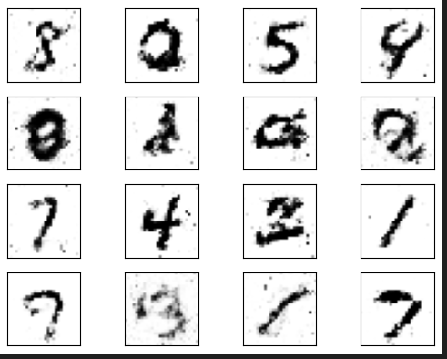
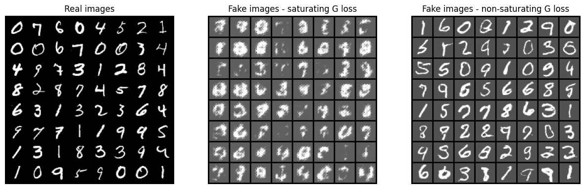

# generating_mnist
MNIST generation using GAN and DCGAN

## GAN

### Discriminator
- Binary classifier (real vs fake images)
- Input: Flattened MNIST images (784 pixels)
- Architecture:
    - 4 fully-connected layers (1024 → 512 → 256 → 1)
    - ReLU activations with Dropout (0.3) for regularization
    - Sigmoid output for probability scoring
- Purpose: Distinguishes between real and generated images

### Generator
- Image generator from random noise
- Input: 100-dimensional random vector (latent space)
- Architecture:
    - 4 fully-connected layers (256 → 512 → 1024 → 784)
    - ReLU activations in hidden layers
    - Tanh output (values between -1 and 1)
- Output: Generated images reshaped to 28×28 pixels (MNIST format)

### Training Setup
- Optimizer: Adam (learning rate: 0.0001)
- Loss Function: Binary Cross Entropy (BCELoss)
- Epochs: 50

---

## DCGAN

### Discriminator
- Input: 1×28×28 images
- Architecture: Convolutional classifier
    - Layers:
        - 4 convolutional layers with stride 2
        - Batch normalization + LeakyReLU (0.2)
        - No activation on final output (uses BCEWithLogits)
- Feature Maps: 28 → 56 → 112 → 1
- Output: Real/fake classification score

### Generator
- Input: 100×1×1 random noise vector
- Architecture: Convolutional transpose (deconvolution) network
    - Layers:
        - 4 transposed convolutional layers
        - Batch normalization + ReLU activation
        - Tanh output (pixel values between -1 and 1)
- Feature Maps: 64 → 128 → 256 → 1
- Output: 1×28×28 generated images

### Training Setup
- Weight Initialization: Normal distribution (mean 0.0, std 0.02)
- Optimizer: Adam (beta1=0.5)
- Loss: BCEWithLogits
- Gradient Tracking: Monitors generator gradients (mean & std)
- Flexible Loss: Supports both saturating and non-saturating GAN objectives
